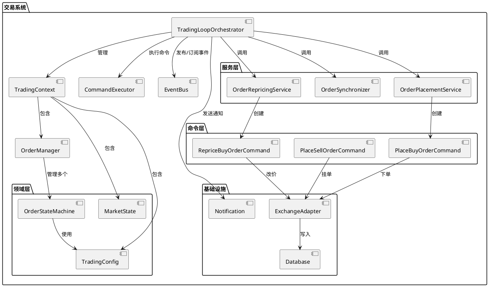
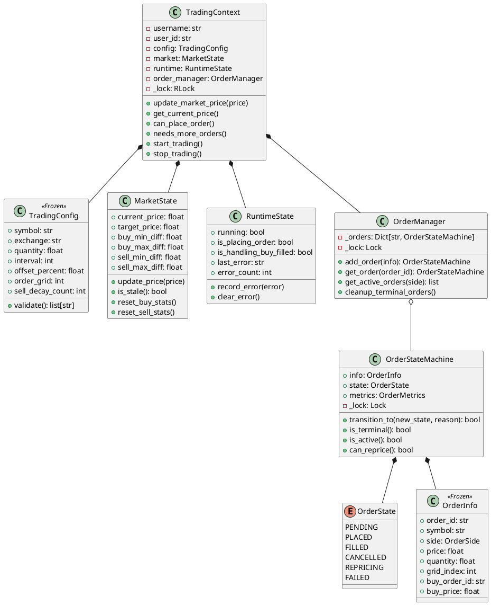
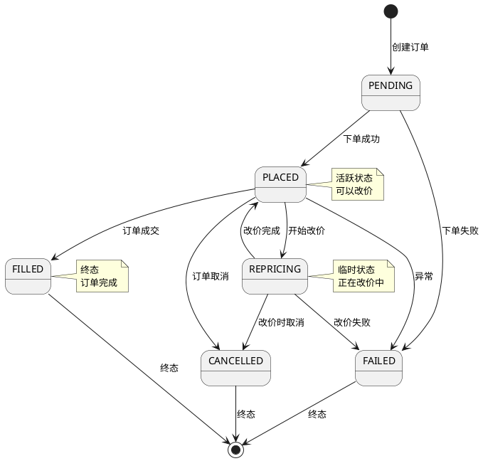
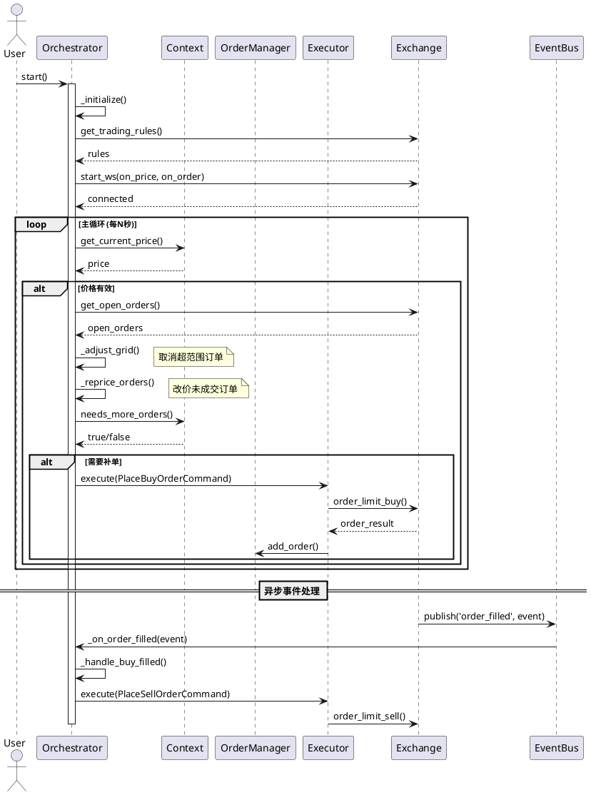
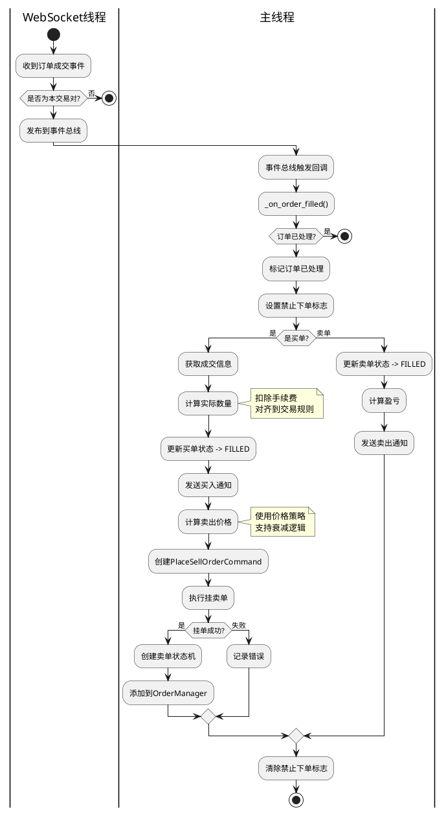
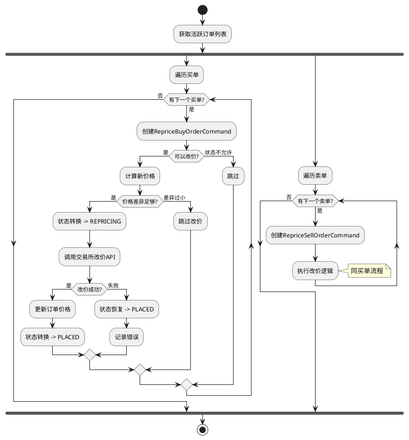
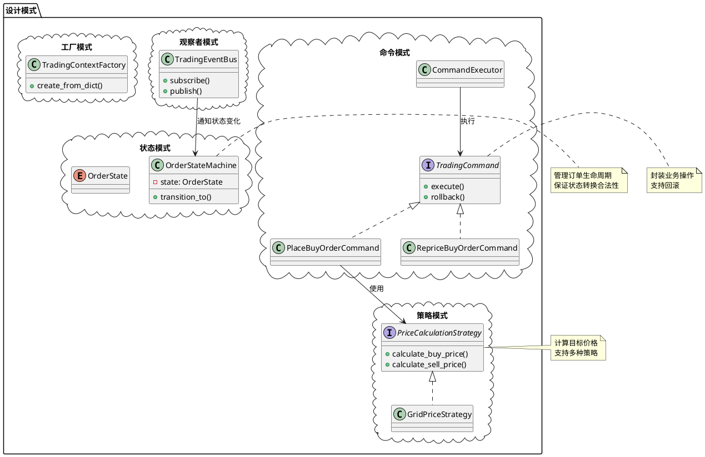
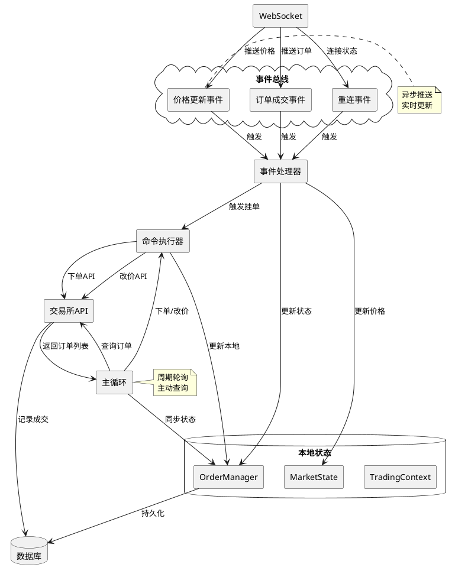
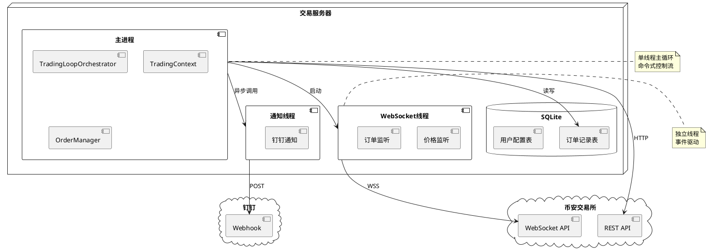
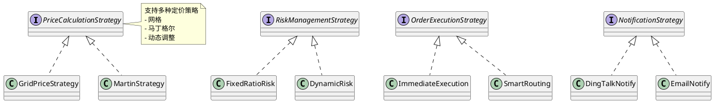

## 📋 项目概述
**项目名称**: 动态网格套利交易系统  
**版本**: 2.0 (重构版)  
**技术栈**: Python 3.8+, WebSocket, Threading  
**核心模式**: 状态机 + 命令模式 + 事件驱动

---

## 🏗️ 系统架构
### 1. 整体架构图


---

## 📦 核心组件
### 2. 类图 - 领域模型


---

## 🔄 核心流程
### 3. 状态机转换图


---

### 4. 主循环序列图


---

### 5. 买单成交流程


---

### 6. 改价流程


---

## 🎯 设计模式应用
### 7. 组件关系图


---

## 📊 数据流图
### 8. 数据流向


---

## 🔧 部署视图
### 9. 部署架构


---

## 📈 性能指标
### 10. 监控指标
```puml
@startuml
!define METRIC rectangle

METRIC "循环性能" as Loop {
    + 循环次数
    + 平均耗时
    + 最大耗时
    + 错误次数
}

METRIC "订单指标" as Order {
    + 总下单数
    + 总成交数
    + 改价次数
    + 取消次数
}

METRIC "交易绩效" as Trade {
    + 总交易次数
    + 平均盈亏
    + 最大盈亏
    + 胜率
}

METRIC "系统健康" as Health {
    + CPU使用率
    + 内存占用
    + 连接状态
    + 最后错误时间
}

@enduml
```

---

## 🚀 重构收益
### 对比原系统
| 维度 | 原系统 | 新系统 | 改进 |
| --- | --- | --- | --- |
| **代码行数** | ~1500行单文件 | ~800行多文件 | -47% |
| **函数参数** | 最多10个 | 最多3个 | -70% |
| **状态管理** | 字典散列 | 状态机集中 | ✅ 类型安全 |
| **并发控制** | 单锁 | 分层锁 | ✅ 细粒度 |
| **可测试性** | 困难 | 简单 | ✅ Mock友好 |
| **扩展性** | 修改原函数 | 新增类 | ✅ 开闭原则 |


---

## 📝 使用示例
### 启动交易
```python
# 创建配置
config = TradingConfig(
    symbol="BTCUSDT",
    exchange="binance",
    quantity=0.01,
    interval=1,
    order_grid=3,
    offset_percent=-0.1,
    sell_offset_percent=0.5
)

# 创建上下文
context = TradingContext(
    username="trader1",
    user_id="uid123",
    config=config,
    exchange=exchange_adapter
)

# 启动编排器
orchestrator = TradingLoopOrchestrator(context)
orchestrator.run()
```

### 查询状态
```python
# 获取活跃订单
active_buys = context.get_active_buy_orders()
active_sells = context.get_active_sell_orders()

# 检查是否可以下单
can_place, reason = context.can_place_order()

# 查看市场状态
current_price = context.market.current_price
target_price = context.market.target_price
```

---

## 🔮 未来扩展
### 可插拔组件


---

## 📚 参考资料
+ **设计模式**: Gang of Four
+ **领域驱动设计**: Eric Evans
+ **微服务架构**: Sam Newman
+ **PlantUML文档**: [https://plantuml.com](https://plantuml.com)

---

**文档版本**: v1.0  
**更新日期**: 2025-01-15  
**维护者**: Trading Team

